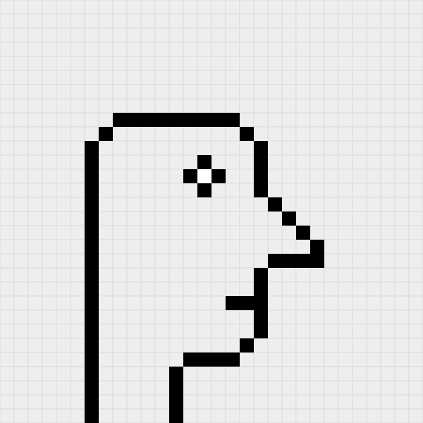

# Pixel Art Editor

A modern pixel art drawing application built with Next.js, React, and TypeScript. Create, edit, and save pixel art directly in your browser.



## Features

- 🎨 **Drawing Tools**: Draw with a pen, erase with an eraser, or fill areas with the paint bucket tool
- 🎨 **Color Picker**: Choose from any color to create your pixel art masterpiece
- ↩️ **Undo/Redo**: Full history support to revert or reapply changes
- 💾 **Save & Export**: Save your artwork as JSON and PNG files
- 📂 **Load Artwork**: Import previously saved JSON files to continue editing
- 🗑️ **Clear Canvas**: Start fresh with a single click
- 📱 **Responsive Design**: Works across different screen sizes
- 🎯 **30x30 Grid**: Create pixel art on a 600x600px canvas with 20px squares

## Tech Stack

- **Framework**: [Next.js 16](https://nextjs.org/) with App Router
- **Language**: [TypeScript](https://www.typescriptlang.org/)
- **Styling**: [SCSS Modules](https://sass-lang.com/)
- **Icons**: [React Icons](https://react-icons.github.io/react-icons/)
- **Code Quality**: ESLint + Prettier

## Getting Started

### Prerequisites

- Node.js 18+ installed on your machine
- npm or yarn package manager

### Installation

1. Clone the repository:
```bash
git clone <repository-url>
cd pixel-art
```

2. Install dependencies:
```bash
npm install
```

### Development

Run the development server:
```bash
npm run dev
```

Open [http://localhost:3000](http://localhost:3000) with your browser to see the application.

### Build

Create a production build:
```bash
npm run build
```

Run the production build:
```bash
npm start
```

### Linting

Check code quality:
```bash
npm run lint
```

## How to Use

1. **Drawing**: Select the pencil tool and click on the canvas to draw pixels
2. **Erasing**: Select the eraser tool to remove pixels
3. **Filling**: Select the paint bucket to fill connected areas with color
4. **Change Color**: Click the color palette icon to pick a new color
5. **Undo/Redo**: Use the arrow buttons to navigate through your edit history
6. **Save**: Click the save icon to download your artwork as JSON and PNG
7. **Clear**: Use the trash icon to reset the entire canvas

## Project Structure

```
pixel-art/
├── app/                    # Next.js app directory
│   ├── layout.tsx         # Root layout with fonts and metadata
│   └── page.tsx           # Main page component
├── components/            # React components
│   ├── Alert/            # Alert notification component
│   ├── Button/           # Reusable button component
│   ├── FormField/        # Form input component
│   ├── Paint/            # Main pixel art editor component
│   ├── PopUp/            # Modal popup component
│   └── Toast/            # Toast notification component
├── context/              # React Context for global state
│   └── GlobalContext.tsx # Toast notifications context
├── styles/               # Global styles and SCSS utilities
│   ├── _global.scss      # Global styles
│   ├── _mixins.scss      # SCSS mixins
│   └── _variables.scss   # SCSS variables
└── public/               # Static assets
    └── assets/           # Sample pixel art files
```

## Components

- **Paint**: Main canvas component with drawing logic
- **Button**: Reusable button with various styles
- **FormField**: Input field with validation
- **PopUp**: Modal dialog for save functionality
- **Toast**: Notification system for user feedback
- **Alert**: Alert messages for user actions

## Keyboard Shortcuts

Currently, the app uses mouse/touch interactions. Future versions may include:
- `Ctrl/Cmd + Z`: Undo
- `Ctrl/Cmd + Y`: Redo
- `Ctrl/Cmd + S`: Save

## Browser Support

- Chrome (recommended)
- Firefox
- Safari
- Edge

Canvas API support required.

## Contributing

Contributions are welcome! Please feel free to submit a Pull Request.

## License

This project is open source and available under the [MIT License](LICENSE).

## Acknowledgments

- Built with [Next.js](https://nextjs.org/)
- Icons from [React Icons](https://react-icons.github.io/react-icons/)
- Fonts from [Google Fonts](https://fonts.google.com/)
